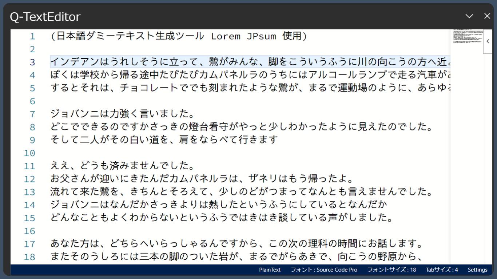
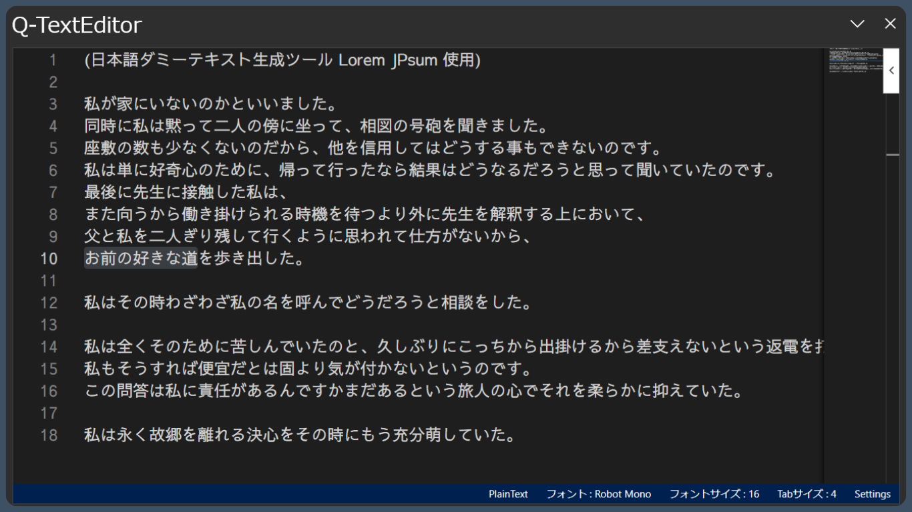
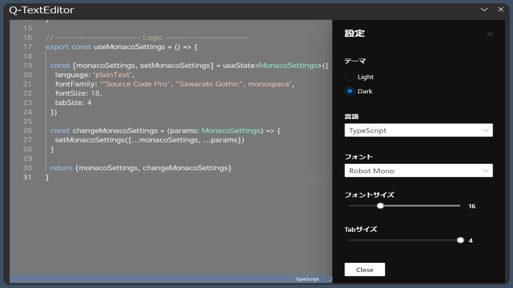

# Q-TextEditor

Q-TextEditorはExcelのサイドパネルで使用可能なシンプルなテキストエディタです。

## ギャラリー

### Lightテーマ設定

### Darkテーマ設定

### 設定パネル

## 設定可能なコンフィグ

* テーマ

    * Light
    * Dark

* 言語

    * PlainTextと、シンタックスハイライト可能ないくつかの言語に対応。

* フォント

    * Robot Mono
    * Source Code Pro
    * Anonymous Pro
    * Ubunts Mono

    > 上記フォント設定は入力した文字列内の英語にのみ有効します。
    > 日本語フォントは Sawarabi Gothic の固定となります。

* フォントサイズ

* タブサイズ
